# ControlValueAccessor (CVA)

## Qué es ControlValueAccessor

Es la interfaz de Angular que permite que un componente custom se conecte al
sistema de formularios de Angular, tanto Reactive Forms como Template-Driven
Forms.

Sin CVA, un input conectado a formularios manualmente necesita bindings
explícitos:

```html
<!-- Without CVA: the consumer has to do everything manually -->
<input
  ha-input-text
  [value]="form.get('email').value"
  (input)="form.get('email').setValue($event.target.value)"
/>
```

Con CVA, el componente se integra de forma nativa:

```html
<!-- With CVA: use it like any native input -->
<input ha-input-text formControlName="email" />
<input ha-input-text [(ngModel)]="email" />
```

## Cómo `HaInputText` Implementa CVA (código real)

`HaInputText` (`libs/input-text/src/lib/input-text.component.ts`) usa un
selector de **atributo** sobre el elemento nativo (`input[ha-input-text]`), no
un elemento custom (`<ha-input-text>`). El host ES el `<input>` nativo — el
componente no tiene template propio (`template: ''`): no hay un signal `value`
intermedio, `writeValue` escribe directamente al DOM.

```typescript
import {
  ChangeDetectionStrategy,
  ChangeDetectorRef,
  Component,
  DestroyRef,
  ElementRef,
  Injector,
  OnInit,
  OnDestroy,
  computed,
  forwardRef,
  inject,
  input,
  signal,
  ViewEncapsulation,
} from '@angular/core';
import { takeUntilDestroyed } from '@angular/core/rxjs-interop';
import { FocusMonitor, FocusOrigin } from '@angular/cdk/a11y';
import {
  ControlValueAccessor,
  NG_VALUE_ACCESSOR,
  NgControl,
} from '@angular/forms';

@Component({
  selector: 'input[ha-input-text]',
  standalone: true,
  template: '',
  styleUrl: './input-text.component.css',
  encapsulation: ViewEncapsulation.None,
  changeDetection: ChangeDetectionStrategy.OnPush,
  providers: [
    {
      provide: NG_VALUE_ACCESSOR,
      useExisting: forwardRef(() => HaInputText),
      multi: true,
    },
  ],
  host: {
    '[class]': 'hostClasses()',
    '[disabled]': 'effectiveDisabled()',
    '[attr.aria-invalid]': 'hasError() ? "true" : null',
    '(input)': 'onInput($event)',
    '(blur)': 'onBlur()',
  },
})
export class HaInputText implements ControlValueAccessor, OnInit, OnDestroy {
  readonly disabled = input(false);
  protected readonly formDisabled = signal(false);
  protected readonly effectiveDisabled = computed(
    () => this.disabled() || this.formDisabled(),
  );

  private onChange: (value: string) => void = () => {};
  private onTouched: () => void = () => {};

  constructor(private readonly elementRef: ElementRef<HTMLInputElement>) {}

  // ControlValueAccessor: writes a model value directly into the native input.
  writeValue(value: string | null): void {
    this.elementRef.nativeElement.value = value ?? '';
  }

  registerOnChange(fn: (value: string) => void): void {
    this.onChange = fn;
  }

  registerOnTouched(fn: () => void): void {
    this.onTouched = fn;
  }

  setDisabledState(isDisabled: boolean): void {
    this.formDisabled.set(isDisabled);
  }

  onInput(event: Event): void {
    this.onChange((event.target as HTMLInputElement).value);
  }

  onBlur(): void {
    this.onTouched();
  }
}
```

_(Extracto simplificado — el archivo real además conecta `size`, `readonly`,
`placeholder`, `ariaLabel`/`ariaDescribedBy`, `focusOrigin` vía CDK
`FocusMonitor`, y la lógica de `hasError` explicada más abajo.)_

No hay template ni `<div class="ha-input-text">` envolvente: el elemento host es
directamente el `<input>` que escribió el consumidor, y las clases BEM
(`ha-input-text--error`, `ha-input-text--disabled`, etc.) se aplican a ese mismo
elemento vía `[class]="hostClasses()"`.

### Ciclo de vida de CVA

El diagrama siguiente resume cuándo Angular invoca cada método de
`ControlValueAccessor` y cómo el componente responde a las interacciones del
usuario:

```mermaid
sequenceDiagram
    participant Angular as Angular Forms
    participant CVA as HaInputText (CVA)
    participant Usuario as Usuario

    Angular->>CVA: registerOnChange(fn)
    Angular->>CVA: registerOnTouched(fn)
    Angular->>CVA: writeValue(valorInicial)
    CVA-->>CVA: escribe el valor directo en el <input>

    Usuario->>CVA: escribe en el input (evento input)
    CVA->>Angular: onChange(nuevoValor)
    Angular-->>Angular: actualiza el FormControl

    Usuario->>CVA: sale del campo (evento blur)
    CVA->>Angular: onTouched()
    Angular-->>Angular: marca el control como touched

    Angular->>CVA: setDisabledState(true/false)
    CVA-->>CVA: formDisabled.set(isDisabled)
```



## Qué Componentes Implementan CVA Hoy

| Component                              | CVA | Value type |
| -------------------------------------- | --- | ---------- |
| `input[ha-input-text]` (`HaInputText`) | Sí  | `string`   |
| `ha-select` (`HaSelect`)               | Sí  | `unknown`  |
| `button[ha-button]` (`HaButton`)       | No  | —          |

`HaSelect` (`libs/select/src/lib/select.component.ts`) sigue el mismo patrón
`NgControl` perezoso / `validityVersion` que `HaInputText`, pero es un elemento
custom con template propio (no un selector de atributo sobre el control nativo):
`writeValue` guarda el valor crudo en un signal `valueState` en vez de escribir
al DOM, y `registerOnChange`/`registerOnTouched` se conectan de la misma forma.
Ver su TSDoc a nivel de clase para la comparación completa.

Los componentes de formulario restantes (`checkbox`, `radio`, `autocomplete`)
todavía no existen en el repo — son roadmap, no un contrato vigente.

## Inyectar `NgControl`: Por Qué No Puede Pasar en el Constructor

Documentación anterior mostraba
`inject(NgControl, { optional: true, self: true })` como inicializador de campo.
**Eso rompe con `NG0200` (DI circular)** en este componente: la directiva
`[formControl]`/`formControlName` vive en el mismo elemento nativo e inyecta
`NG_VALUE_ACCESSOR` en su propio constructor — que es `HaInputText`. Resolver
`NgControl` en tiempo de construcción crea el ciclo.

La solución real lo resuelve de forma perezosa, en la primera lectura, usando un
`Injector` inyectado y un getter:

```typescript
private readonly injector = inject(Injector);

private get ngControl(): NgControl | null {
  return this.injector.get(NgControl, null, { self: true, optional: true });
}
```

`ngControl.valueAccessor` nunca se asigna manualmente — Angular lo resuelve por
su cuenta vía `selectValueAccessor`, porque `HaInputText` ya está registrado
como `NG_VALUE_ACCESSOR`.

## `hasError`: Por Qué No Es un `computed()` Simple

`control.invalid` y `control.touched` **no son signals** — un `computed()` que
los lee directamente se evalúa una vez y queda cacheado para siempre (verificado
empíricamente contra Angular 19). La solución real usa un signal
`validityVersion` que se incrementa suscribiéndose al stream `control.events`
(cubre touched, status y cambios de value — `statusChanges` por sí solo se
pierde la transición blur/touch):

```typescript
private readonly validityVersion = signal(0);

protected readonly hasError = computed(() => {
  this.validityVersion(); // invalidation dependency
  const control = this.ngControl?.control;
  return control != null && control.invalid && control.touched;
});

ngOnInit(): void {
  const control = this.ngControl?.control;
  control?.events.pipe(takeUntilDestroyed(this.destroyRef)).subscribe(() => {
    this.validityVersion.update((v) => v + 1);
    this.cdr.markForCheck();
  });
}
```

`hasError` solo maneja estado (`.ha-input-text--error` + `aria-invalid`).
`HaInputText` no renderiza ningún mensaje de error visual
(`<span class="ha-input-text__error">` no existe) ni un pipe `paFormError` — no
está en el repo. Mostrar el texto del error es responsabilidad del consumidor.

## Testear CVA (patrón real: TestBed, no Angular Testing Library)

Los tests reales usan `TestBed` + `fixture.debugElement.query(By.css(...))`, no
`@testing-library/angular` (esa dependencia no está en `package.json`):

```typescript
describe('HaInputText - CVA', () => {
  it('writes the form control value into the native input', () => {
    // TestBed.configureTestingModule({ imports: [ReactiveFormsModule] }), etc.
    // form.get('name')?.setValue('updated');
    // expect(input.nativeElement.value).toBe('updated');
  });

  it('propagates user input to the form control via onChange', () => {
    // input.nativeElement.value = 'Josep';
    // input.nativeElement.dispatchEvent(new Event('input'));
    // expect(form.get('name')?.value).toBe('Josep');
  });

  it('disables the native input when the form control is disabled', () => {
    // form.get('name')?.disable();
    // expect(input.nativeElement.disabled).toBe(true);
  });
});
```

Ver [Testing Strategy](./testing-strategy.md) para el patrón completo
`TestBed` + Test Host usado en los specs reales.

## Reglas del Equipo

- Todo componente de formulario DEBE implementar `ControlValueAccessor`.
- `NgControl` DEBE resolverse de forma perezosa (un getter sobre `Injector`,
  `{ self: true, optional: true }`), nunca como inicializador de campo — evita
  `NG0200`.
- Los componentes NO DEBEN romperse cuando se usan fuera de un formulario.
- El estado de error (`invalid && touched`) se expone vía una clase BEM +
  `aria-invalid`; el mensaje de error visual es responsabilidad del consumidor,
  no del componente.
- Los tests DEBEN cubrir los casos de CVA: `writeValue`, `onChange` (vía el
  evento `input`), `setDisabledState`.
