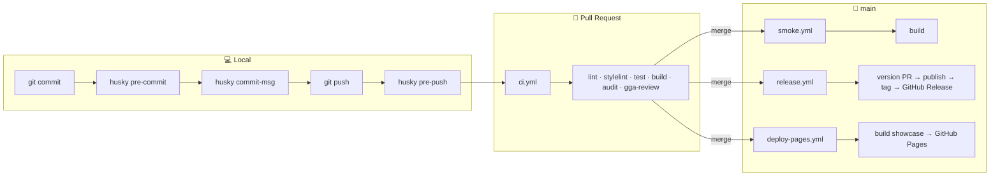
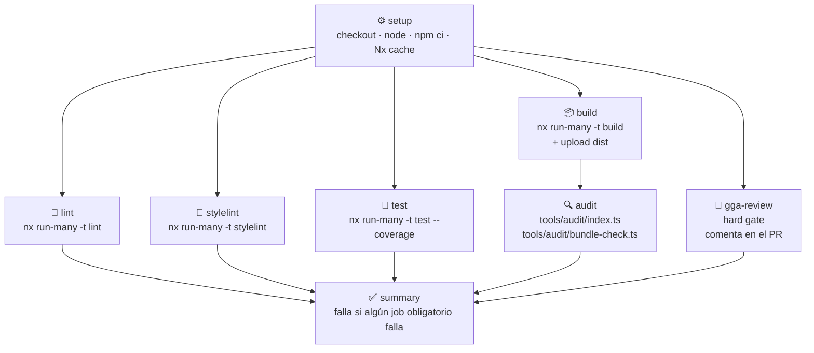
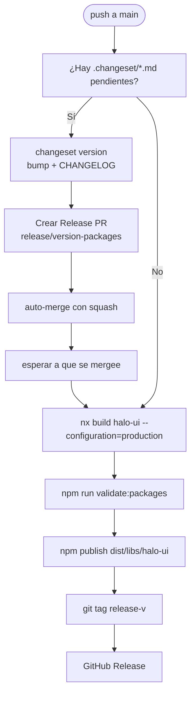
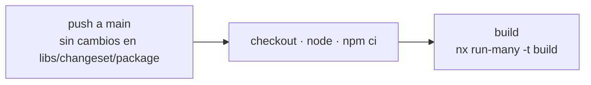
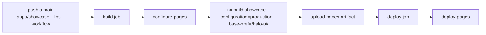
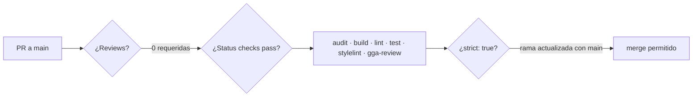
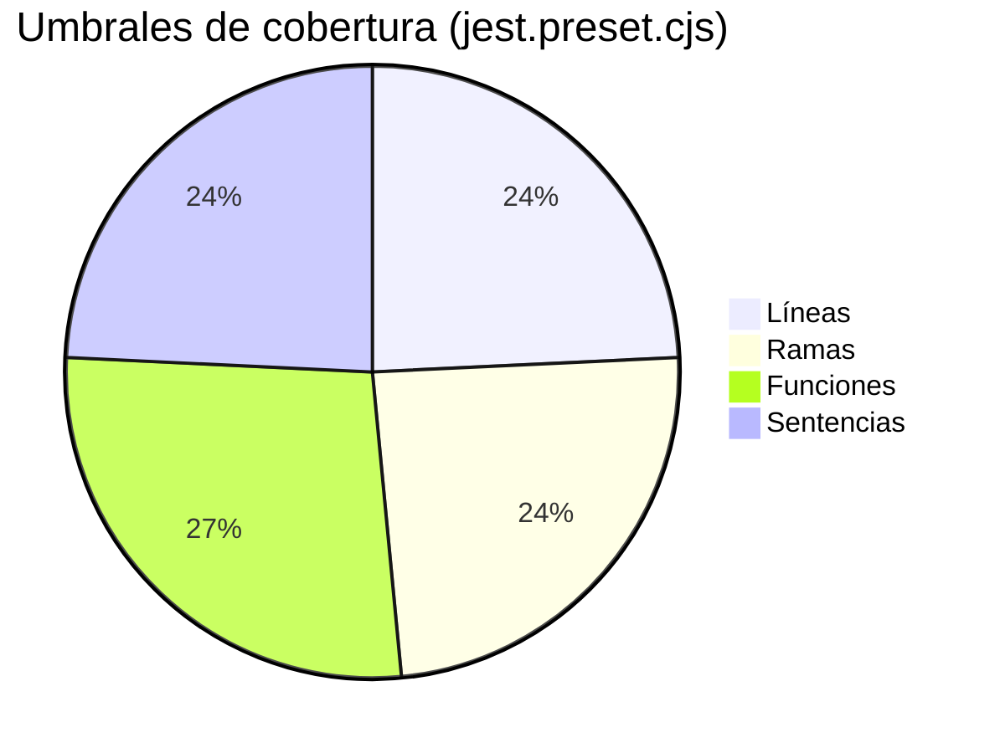

# Guía visual de workflows, CI y jobs

> Mapa de ruta del flujo de trabajo de `halo-ui`: desde un PR local hasta el
> paquete publicado en npm y la showcase desplegada en GitHub Pages. Para los
> detalles técnicos completos ver [`ci-cd-pipeline.md`](./ci-cd-pipeline.md) y
> [`release-and-publishing.md`](./release-and-publishing.md).

---

## 1. Vista de 10.000 pies

---

## 2. Workflows: qué se ejecuta y cuándo

| Workflow           | Trigger                           | Propósito en una frase                            |
| ------------------ | --------------------------------- | ------------------------------------------------- |
| `ci.yml`           | `pull_request`                    | Valida el PR antes del merge.                     |
| `release.yml`      | `push` a `main` (paths filtrados) | Crea la Release PR y publica en npm.              |
| `smoke.yml`        | `push` a `main` (paths ignorados) | Build post-merge para detectar fallas de entorno. |
| `deploy-pages.yml` | `push` a `main` (paths filtrados) | Despliega la app showcase en GitHub Pages.        |

---

## 3. `ci.yml`: el pipeline de PR

### Jobs de `ci.yml`

| Job          | Comando principal                              | Obligatorio para merge | Detalle clave                                                                                                                                                                           |
| ------------ | ---------------------------------------------- | ---------------------- | --------------------------------------------------------------------------------------------------------------------------------------------------------------------------------------- |
| `lint`       | `nx run-many -t lint`                          | Sí                     | ESLint en todos los proyectos.                                                                                                                                                          |
| `stylelint`  | `nx run-many -t stylelint`                     | Sí                     | Lint de CSS en `libs/**/*.css`.                                                                                                                                                         |
| `test`       | `nx run-many -t test --coverage`               | Sí                     | Jest + cobertura. Umbral: 80/80/90/80.                                                                                                                                                  |
| `build`      | `nx run-many -t build`                         | Sí                     | Sube `dist/` como artifact (7 días).                                                                                                                                                    |
| `audit`      | `tsx tools/audit/index.ts` + `bundle-check.ts` | Sí                     | Descarga `dist/` del job `build`.                                                                                                                                                       |
| `gga-review` | `gga run --pr-mode --ci`                       | Sí                     | Revisión de IA. El job parsea el último `STATUS:` del log; `PASSED` permite el merge, cualquier otro resultado (`FAILED`, `AMBIGUOUS` o sin `STATUS:`) falla el job y bloquea el merge. |
| `summary`    | Verifica resultados                            | Implícito              | Falla si algún job obligatorio no es `success`.                                                                                                                                         |

---

## 4. `release.yml`: de `main` a npm

### Momentos clave del release

| Paso                | Qué hace                                                                         | Bloquea el release              |
| ------------------- | -------------------------------------------------------------------------------- | ------------------------------- |
| Check de changesets | Detecta `.changeset/*.md` no consumidos.                                         | No (solo decide el camino).     |
| `changeset version` | Actualiza versiones y CHANGELOGs.                                                | No.                             |
| Release PR          | Abre PR con los cambios de versión.                                              | No.                             |
| Build               | Compila `halo-ui` en modo producción.                                            | Sí.                             |
| `validate:packages` | Verifica entry points, `exports`, y que el publish apunte a `dist/libs/halo-ui`. | Sí.                             |
| `npm audit`         | Audit no-dev, nivel critical.                                                    | No (`continue-on-error: true`). |
| Publish             | Publica `@halolib-ui/angular` en npm.                                            | Sí.                             |
| Tag + Release       | Crea `release-v<version>` y GitHub Release.                                      | No.                             |

---

## 5. `smoke.yml`: verificación post-merge

**¿Por qué solo build?** Branch protection ya exige que el PR esté actualizado
con `main` y pase `ci.yml`, así que lint/test ya se validaron. `smoke.yml`
detecta problemas de entorno: registro caído, secret rotado, runner drift.

---

## 6. `deploy-pages.yml`: showcase en GitHub Pages

---

## 7. Hooks locales (husky)

| Hook         | Cuándo                 | Qué ejecuta                                    |
| ------------ | ---------------------- | ---------------------------------------------- |
| `pre-commit` | Antes de cada commit   | `gga run` (si está instalado) + `lint-staged`. |
| `commit-msg` | Al escribir el mensaje | `commitlint` con Conventional Commits.         |
| `pre-push`   | Antes de cada push     | `nx affected -t build --base=origin/main`.     |

### `lint-staged` por tipo de archivo

| Patrón                    | Acción                              |
| ------------------------- | ----------------------------------- |
| `*.ts`                    | `eslint --fix`                      |
| `libs/**/*.css`           | `stylelint`                         |
| todo excepto `.claude/**` | `prettier --write --ignore-unknown` |

---

## 8. Nx targets relevantes

| Target      | Proyecto   | Executor / comando                          | Usado por                       |
| ----------- | ---------- | ------------------------------------------- | ------------------------------- |
| `build`     | `halo-ui`  | `@nx/angular:package` (ng-packagr)          | `ci.yml`, `release.yml`         |
| `build`     | `showcase` | `@angular-devkit/build-angular:application` | `smoke.yml`, `deploy-pages.yml` |
| `test`      | todos      | `@nx/jest:jest`                             | `ci.yml`                        |
| `lint`      | todos      | `@nx/eslint:lint`                           | `ci.yml`                        |
| `stylelint` | todos      | `stylelint "{projectRoot}/**/*.css"`        | `ci.yml`                        |

---

## 9. Secrets y permisos

| Secret / token     | Workflow              | Para qué                                             |
| ------------------ | --------------------- | ---------------------------------------------------- |
| `NPM_TOKEN`        | `release.yml`         | Publicar en npm.                                     |
| `OPENCODE_API_KEY` | `ci.yml` (gga-review) | Inferencia del modelo de IA.                         |
| `GITHUB_TOKEN`     | Todos                 | Comentarios, crear PRs, releases, tags. (Automático) |

---

## 10. Branch protection en `main`

| Regla                           | Valor                                                       |
| ------------------------------- | ----------------------------------------------------------- |
| Require PR antes de merge       | ✅ Sí                                                       |
| Reviews requeridas              | 0 (proyecto unipersonal)                                    |
| Dismiss stale approvals         | ✅ Sí                                                       |
| Status checks requeridos        | `audit`, `build`, `lint`, `test`, `gga-review`, `stylelint` |
| Strict (rama actualizada)       | ✅ Sí                                                       |
| Require conversation resolution | ✅ Sí                                                       |
| Include administrators          | ✅ Sí                                                       |
| Force pushes                    | ❌ No permitidos                                            |
| Deletions                       | ❌ No permitidas                                            |

---

## 11. Cobertura de tests

Si algún proyecto cae por debajo de estos umbrales, el job `test` de `ci.yml`
falla y bloquea el merge.

---

## 12. Decisiones de diseño importantes

| Decisión                               | Por qué                                                                                                                                                         |
| -------------------------------------- | --------------------------------------------------------------------------------------------------------------------------------------------------------------- |
| `ci.yml` no usa `nx affected`          | Corre `nx run-many` para garantizar que todo el workspace siga verde, no solo lo afectado.                                                                      |
| Cada job hace su propio checkout/setup | Los jobs no comparten filesystem; el único estado compartido son los artifacts `dist/` y `coverage/`.                                                           |
| `gga-review` es un hard gate           | Es un required status check sin `continue-on-error`; cualquier veredicto distinto de `STATUS: PASSED` (`FAILED`, `AMBIGUOUS` o sin `STATUS:`) bloquea el merge. |
| Release usa Release PR                 | `changeset version` no commitea directamente a `main`; abre una PR para revisión.                                                                               |
| Publish apunta a `dist/libs/halo-ui`   | Evita publicar el código fuente en lugar del build (regresión #85).                                                                                             |
| `validate:packages` bloquea el publish | Verifica `exports`, `types`, y ausencia de dependencias cruzadas `@halolib-ui/*`.                                                                               |

---

## 13. Checklist rápido para contribuidores

- [ ] Antes de commitear: `npm run format:check`, `nx affected -t build`.
- [ ] El mensaje de commit sigue Conventional Commits (`feat`, `fix`, `docs`,
      ...).
- [ ] Si el PR cambia código publicable, incluir un `.changeset/*.md`.
- [ ] Todos los status checks de `ci.yml` deben estar verdes antes de mergear.
- [ ] No usar `[skip ci]` en commits que toquen `apps/**`, `libs/**` o
      `tools/**`.

---

## Referencias

- [`docs/ci-cd-pipeline.md`](./ci-cd-pipeline.md) — contrato completo del
  pipeline.
- [`docs/release-and-publishing.md`](./release-and-publishing.md) — flujo de
  publicación en npm.
- [`.github/workflows/ci.yml`](https://github.com/JosepFernande/halo-ui/blob/main/.github/workflows/ci.yml)
- [`.github/workflows/release.yml`](https://github.com/JosepFernande/halo-ui/blob/main/.github/workflows/release.yml)
- [`.github/workflows/smoke.yml`](https://github.com/JosepFernande/halo-ui/blob/main/.github/workflows/smoke.yml)
- [`.github/workflows/deploy-pages.yml`](https://github.com/JosepFernande/halo-ui/blob/main/.github/workflows/deploy-pages.yml)
